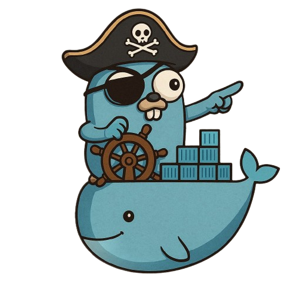
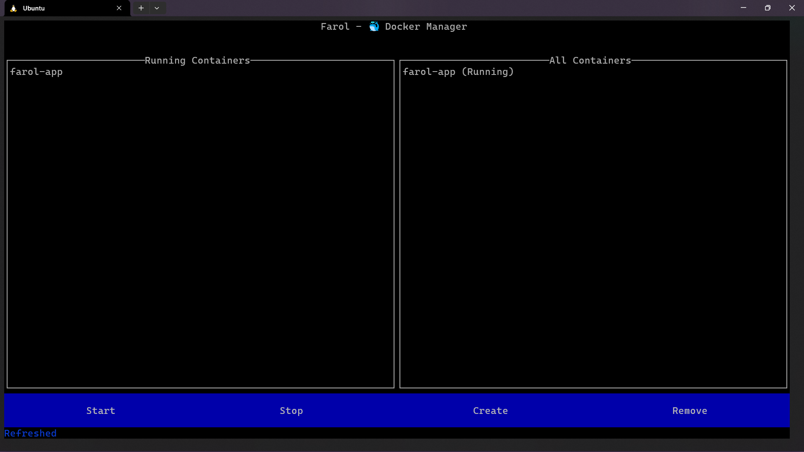
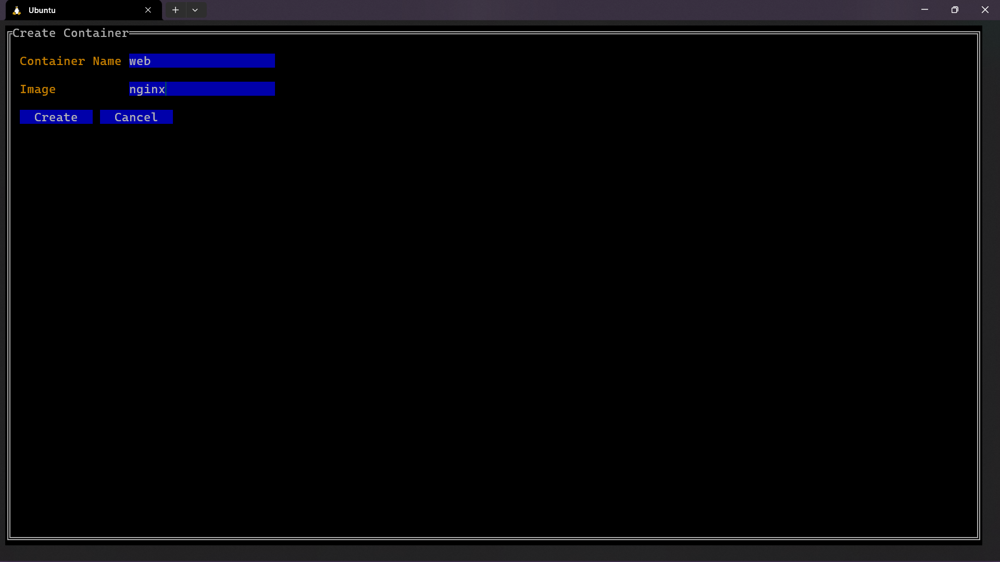
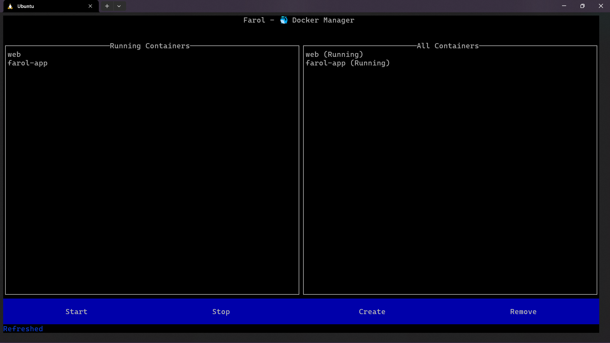
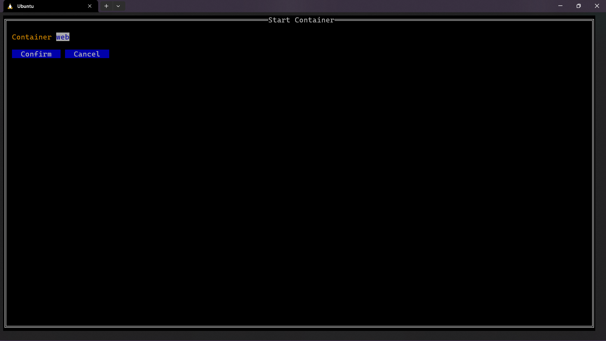
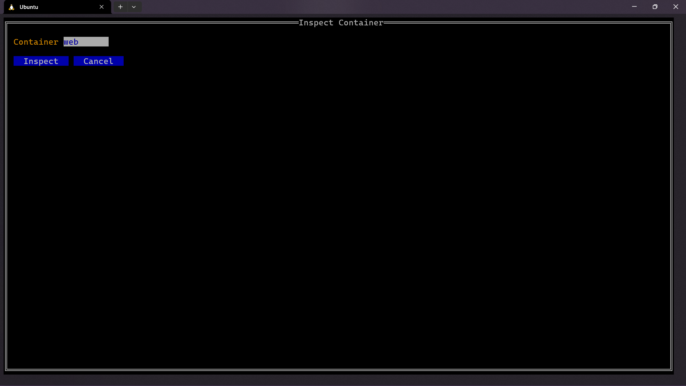
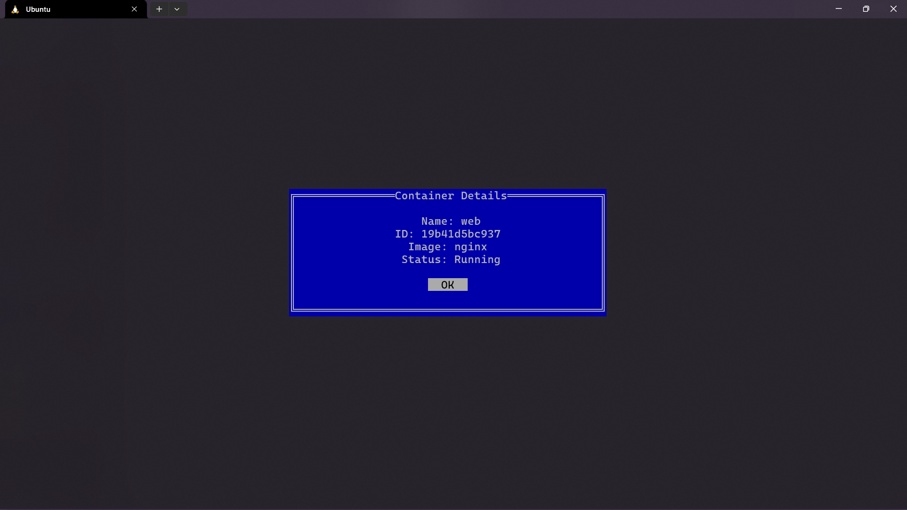
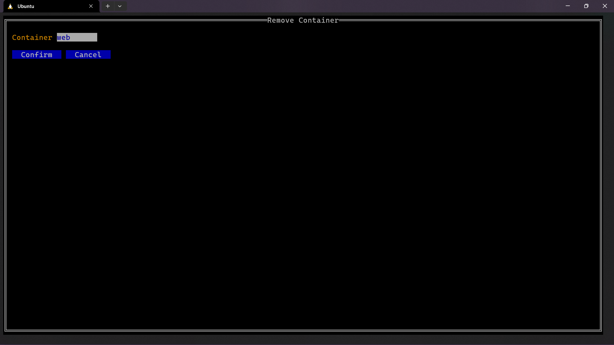

# 🚢 Farol - Terminal UI for Docker Monitoring 

Farol (Portuguese for Lighthouse) is a lightweight and powerful TUI (Terminal User Interface) built with Go. Just as a lighthouse guides ships through the dark, Farol illuminates your local Docker environment, allowing you to easily view, manage, start, and stop your containers directly from the comfort of your terminal.

This project is a **terminal-based Docker container dashboard** built using [💻 Golang](https://golang.org) and the [📦 tview](https://github.com/rivo/tview) library.

It gives users a visual way to **monitor**, **start**, and **stop** Docker containers, acting as a lightweight alternative to Docker Desktop — all from your terminal.



---

## 🏎️ How to run it

Use Docker to run it with no issues in the right versions - remember to have Docker installed and ready-to-use.

1. Clone the repository

```shell
git clone https://www.github.com/Axelvazslima/farol.git
cd farol
```

2. Build the docker image and run the container

```shell
docker build -t farol .
docker run -it --rm -v /var/run/docker.sock:/var/run/docker.sock --name "Farol-App" farol
```

3. To stop the application, run -- or stop the container that is running the app:

```shell
[ctrl/cmd] c
```

---

## 🚀 Features

- 🟢 View running containers
- 📦 List all containers
- ▶️ Start stopped containers
- 🔍 Inspect container details
- ⏹️ Stop running containers
- 🖱️ Mouse support for easy interaction
- ✨ Built with pure CLI and Go — no browser or Electron involved!

---

## 🤔 How does it look?

### 🏠 Home

When you start the program, you'll see a list of your currently running containers on the left, and all containers (running or stopped) on the right — including the program’s own container ("Farol App").



---

### 🐳 Create a Container

Click **"Create"**, then enter a **container name** and the **Docker image** you'd like to use.



After creation, the container will show up in both lists — as it’s already running:



---

### ⛔ Stop a Container

Click **"Stop"** and select the container you want to stop:


Once stopped, the container will disappear from the “Running Containers” list and remain only in “All Containers” with a status of **Stopped**:


---

### ▶️ Start a Container

To start a previously stopped container, click **"Start"** and choose the one you want to reactivate:



It will show up again in both views as **running**:


---

### 🔍 Inspect a Container

Click **"Inspect"** to open a details modal showing container name, ID, image used, and current status.



Now, you can see its ID, image and name



---

### 🗑️ Remove a Container

To delete a container, make sure it is **stopped**, then click **"Remove"** and select it:



Once removed, the container will no longer appear in any list:


---

##  🛠️ What I Practiced

### 💻 Golang
Strengthened my Go skills while building a CLI UI with concurrency and system commands.

### 🐚 Shell + CLI
Learned how to parse and process terminal command outputs effectively.

### 🐳 Docker
Deepened my understanding of container lifecycle commands like ps, start, stop, inspect, and more.

---

## 👨‍💻 Who is it for?

Developers already using Docker who want a visual, terminal-friendly dashboard

Beginners who find docker CLI commands hard to remember or use

Anyone looking for a minimal and fast alternative to Docker Desktop

---

## 📦 Learn more about Docker

If you want to learn more about Docker, Kubernetes (etc.) check my [Docker tutorial](https://www.github.com/Axelvazslima/docker-studies).

---

## 🙋 Who Am I?

I am a brazilian undergrad CS student @ UFCG who is interested in

* 🛡️ Cybersecurity

* ☁️ Cloud Computing

* 🧠 Artificial Intelligence

---

### Star this repo 🌟 and give me a follow 🐧